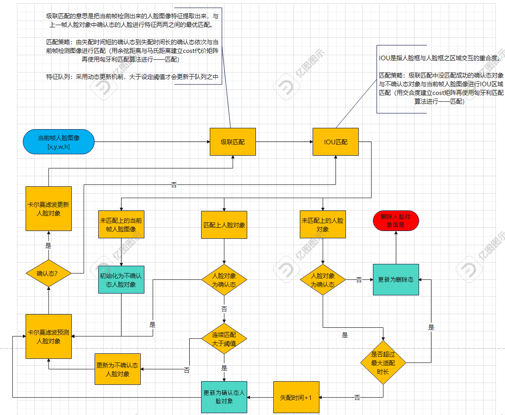

记录一下deepsort算法流程图，输入部分的detector可以任意替换目标检测算法，人脸图像只是举例我们追踪的是人脸特征，追踪算法不单单可以追踪人脸。
Deepsort算法的流程如下：
Deepsort

1. 输入：视频帧序列和目标检测结果（包括目标的位置和类别）。
2. 目标检测：使用预训练的目标检测模型（如YOLO、Faster R-CNN等）对视频帧进行目标检测，得到每个帧中的目标框和类别。
3. 特征提取：对每个目标框中的图像区域，使用预训练的深度卷积神经网络（如ResNet、MobileNet等）提取特征向量。
4. 目标跟踪：将每个帧中的目标特征向量与之前帧中的目标特征向量进行匹配，使用匈牙利算法（Hungarian Algorithm）进行最优匹配。
5. 目标关联：根据匹配结果，将目标框与之前帧中的目标进行关联。如果目标框在当前帧中被检测到，将其与之前帧中的目标进行关联；如果目标框在当前帧中未被检测到，将其视为新目标。